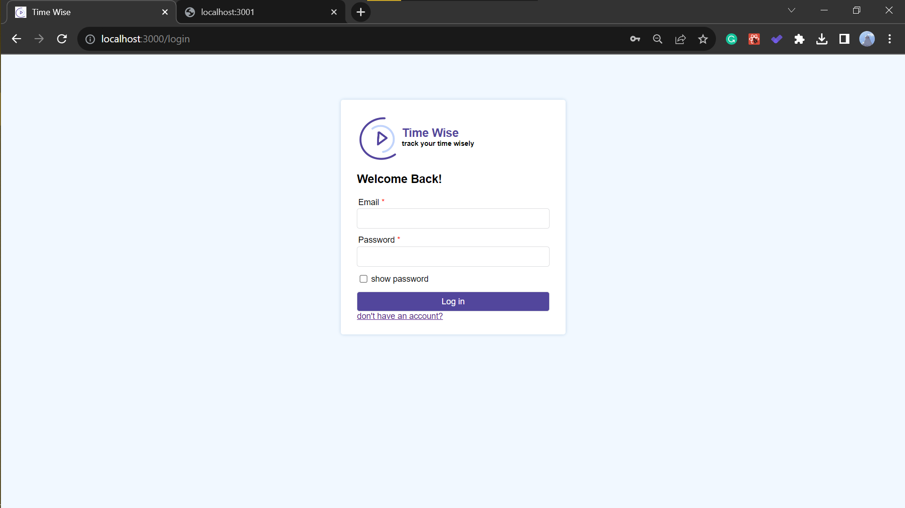

# Getting Started 

### `npm start`

Runs the app in the development mode.\
Open [http://localhost:3000](http://localhost:3000) to view it in the browser.

You should run the backend side in this repo [https://github.com/MariamHasanat/time-wise-api]
### Connect Client side with Server side 
Do not forget to create `.env` file and write the password to connect the frontend side with the server side.
to get the password plz contact me using the email `201011@ppu.edu.ps`
### Login Page 

### Sign-up Page

### Create a new user process
1. enter user name 
2. enter email 
3. enter the password and confirm it.
   if the user enters an existing email, the site will alert him to change the email, 
   if the user enters a password different from the confirmed password the site will alert him.

The checkbox to show the password will reveal the password to the user.

### Successfully create a new user

### Login process 

1. enter the email 
2. enter the password 

If the email does not exist or the password is wrong, the site will alert the user.

The correct email and password will allow the user to log in to the application.

If the user tries to enter the application in an illegal way, the site will prevent him as well as display him an alert.

 

